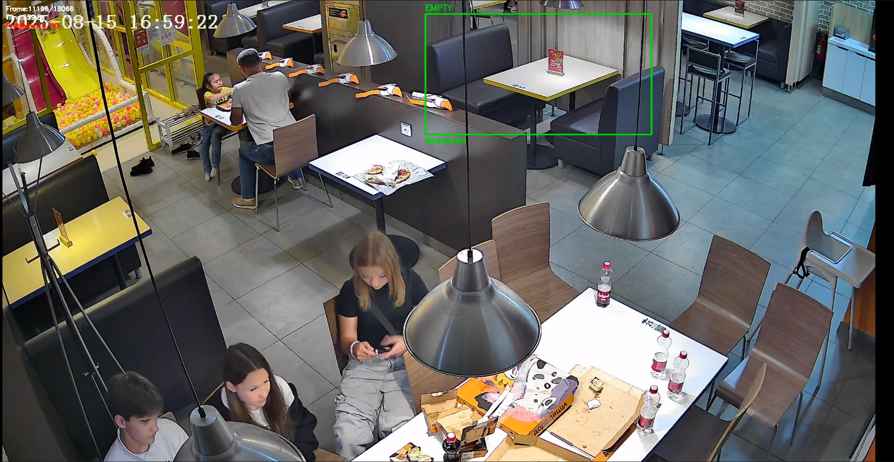
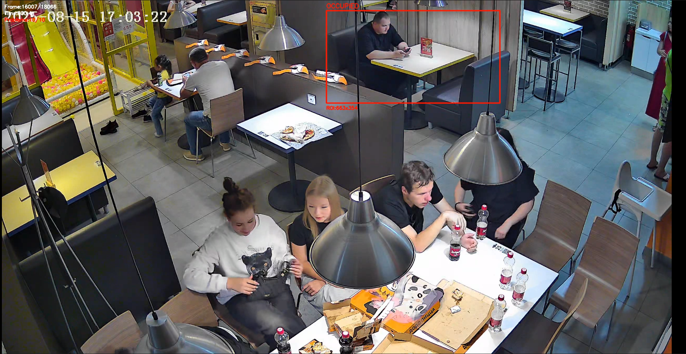

```markdown
# Детектор занятости столиков (прототип)

Программа позволяет определить автоматически, когда столик в кафе или ресторане свободен, а когда занят. Также обнаруживается момент, когда человек проходит мимо выделенного столика. На вход выдается видеозапись, выделяется мышкой интересующий столик – и программа сама отмечает все моменты, когда гости приходят и уходят, а в конце выдаёт отчёт: сколько времени в среднем проходит между уходом одних посетителей и приходом следующих, также фиксируется проход людей мимо столиков, в том числе и уборщиков.

На выходе получается видео с цветной рамкой (зелёная – свободно, красная – занято), текстовый отчёт и картинки с «подозрительными» кадрами, чтобы можно было определить, насколько хорошо работает алгоритм.


## Стек технологий

- **Python 3.8 или новее**.
- **Библиотеки**: OpenCV, Pandas, NumPy, Ultralytics YOLO (опционально).
- **Видеофайл** в формате, который поддерживает OpenCV (MP4, AVI и т.п.).

## Установка

1. Скачайте или клонируйте репозиторий:
   ```bash
   git clone https://github.com/your-username/table-detector.git
   cd table-detector
   ```
2. Установите зависимости (лучше в виртуальном окружении):
   ```bash
   pip install -r requirements.txt
   ```
   Содержимое `requirements.txt`:
   ```
   opencv-python
   pandas
   numpy
   ultralytics
   ```

## Запуск проекта

Базовый запуск (с использованием YOLO):
```bash
python main.py video1.mp4
```

Если хотите использовать только детекцию движения (например, если YOLO не установлен или видео низкого качества):
```bash
python main.py video1.mp4 --no-yolo
```

После запуска откроется окно с первым кадром видео. **Выделите столик мышкой** (зажмите левую кнопку, растяните прямоугольник) и нажмите `SPACE` для подтверждения. Если ошиблись – нажмите `R` для сброса. Минимальный размер области – 50×50 пикселей.

Далее программа начнёт обрабатывать видео. В консоли вы увидите прогресс-бар и текущее состояние. По окончании работы в папке появятся три результата:
- `output.mp4` – обработанное видео с наложенной разметкой.
- `report.txt` – подробный отчёт.
- `problem_frames/` – папка с подозрительными кадрами (если таковые были).

## Подробнее об алгоритме

Программа построена как класс `TableDetector`. Вот его ключевые части.

### 1. Инициализация

При создании объекта загружаются:
- Видеофайл.
- Модель YOLO (если разрешено и доступна).
- BackgroundSubtractor MOG2 для детекции движения.
- Параметры по умолчанию (пороги, пути сохранения).

```python
self.bg_subtractor = cv2.createBackgroundSubtractorMOG2(history=300, varThreshold=40, detectShadows=True)
```

### 2. Выбор области интереса (ROI)

Метод `select_roi()` показывает первый кадр и позволяет пользователю нарисовать прямоугольник. После подтверждения координаты сохраняются в `self.table_roi = (x, y, w, h)`. Это основной регион, за которым мы следим.

### 3. Детекция движения

Метод `detect_motion_roi()`:
- Вырезает область столика из кадра.
- Применяет вычитание фона, получая маску переднего плана.
- Удаляет тени (значение 127).
- Применяет морфологическую фильтрацию (открытие и закрытие) для удаления шума.
- Считает количество ненулевых пикселей и сравнивает с `MOTION_THRESHOLD` (по умолчанию 800).

Если пикселей движения больше порога – возвращает `True`.

### 4. Детекция людей (YOLO)

Метод `detect_person_near()`:
- Запускает YOLOv8 на всём кадре с порогом уверенности 0.4 и классом `person` (0).
- Для каждого найденного человека проверяет:
  - Пересекается ли его ограничивающий прямоугольник с ROI столика.
  - Если нет – считает расстояние от центра столика до центра человека. Если расстояние меньше `NEAR_PERSON_DISTANCE` (100 пикселей), считаем, что человек рядом.

Возвращает `True`, если хотя бы одно условие выполнено.

### 5. Определение занятости

Метод `is_occupied()` объединяет результаты:
```python
return self.detect_motion_roi(frame) or self.detect_person_near(frame)
```
То есть столик считается занятым, если есть движение ИЛИ рядом есть человек.

### 6. Гистерезис (подтверждение состояний)

В основном цикле `process_video()` для каждого кадра вызывается `is_occupied()`. Но состояние меняется не сразу, а только после накопления достаточного количества кадров с одним и тем же признаком:

- Для перехода в **«занято»** нужно `MOTION_CONFIRM_FRAMES` (15) последовательных кадров с `occupied=True`.
- Для перехода в **«свободно»** нужно `EMPTY_CONFIRM_FRAMES` (60) последовательных кадров с `occupied=False`.

Это защищает от ложных срабатываний из-за кратковременных помех (прошёл официант, тень от облака).

### 7. Логирование событий

При каждом устойчивом переходе вызывается `log_event()`, который добавляет запись в список `self.events`:
- номер кадра
- время в секундах
- новое состояние
- причина (motion / person / clear)

### 8. Проблемные кадры

В процессе обработки программа может сохранить до `MAX_PROBLEM_FRAMES` (10) кадров, которые кажутся подозрительными:

- `false_motion` – движение есть, а человека рядом нет (возможно, тень или блик).
- `person_miss` – человек рядом есть, а движения нет (человек замер, например, сидит неподвижно).
- `stuck_occupied` – столик остаётся занятым более 5 минут (возможно, залипшее состояние).

Каждый такой кадр сохраняется в папку `problem_frames/` с аннотацией, чтобы вы могли вручную оценить ситуацию.

### 9. Визуализация и запись видео

На каждом кадре рисуется:
- Рамка столика (цвет меняется в зависимости от состояния).
- Текст с текущим состоянием (`EMPTY` или `OCCUPIED`).
- Служебная информация: номер кадра, время, количество сохранённых проблемных кадров.

Затем кадр записывается в выходной файл `output.mp4`.

### 10. Анализ результатов

По окончании обработки вызывается `analyze_results()`, который:
- Выводит в консоль таблицу событий.
- Вычисляет задержки: время между событием `empty` (стол освободился) и следующим `occupied` (новые гости).
- Формирует текстовый отчёт `report.txt` со всей статистикой и списком проблемных кадров.

## Результаты на примере

В тестовом видео `video1.mp4` (2560×1440, 20 FPS, длительность 15 минут) был выбран столик с координатами `(1240, 39, 663, 354)`. Программа зафиксировала 3 прихода гостей и вычислила среднее время между освобождением столика и следующим занятием – около 11 секунд.

  
*Выделение столика мышкой (видео 1)*

  
*Кадр из обработанного видео: красная рамка – столик занят или человек прошел мимо выделенной области.*

[Ссылки на архивы итоговых видео](https://drive.google.com/drive/folders/1sv7hWvMjxRX75midq1idTG4JpI79-tp0?usp=drive_link)

## Отчёт

`report.txt` содержит:
- Дату и время обработки.
- Информацию о видео и ROI.
- Количество переходов и среднюю задержку.
- Таблицу всех событий (кадр, время, состояние, причина).
- Список сохранённых проблемных кадров.

Пример фрагмента:
```
ОТЧЕТ ДЕТЕКЦИИ ЛЮДЕЙ ЗА СТОЛИКАМИ 25.03 12:56
============================================================
ВИДЕО: video1.mp4
ROI: 663x354 пикселей в позиции (1240,39)

РЕЗУЛЬТАТ:
Переходов "пустой -> занятый стол": 3
Среднее время задержки: 11.2 секунд

СОБЫТИЯ:
 frame  time  state    reason
   825  41.2  occupied motion
   ...   ...  empty    clear
   ...   ...  occupied person
   ...   ...  empty    clear
```

## Настройка порогов

В коде есть несколько параметров, которые можно подстроить под конкретное видео. Они находятся в `__init__` класса `TableDetector`.

| Параметр | Значение по умолчанию | Что делает |
|----------|----------------------|------------|
| `MOTION_THRESHOLD` | 800 | Количество пикселей движения в ROI, чтобы считать, что есть движение. Если слишком мало – будут ложные срабатывания. Слишком много – можете пропустить движение. |
| `MOTION_CONFIRM_FRAMES` | 15 | Сколько кадров подряд должно быть движение, чтобы перейти в «занято». Увеличьте, если часто срабатывает на проходящих мимо. |
| `EMPTY_CONFIRM_FRAMES` | 60 | Сколько кадров подряд должно быть без движения, чтобы перейти в «свободно». Увеличьте, если гости замирают, и вы не хотите, чтобы столик рано освобождался. |
| `NEAR_PERSON_DISTANCE` | 100 | Максимальное расстояние от центра столика до центра человека, при котором человек считается «рядом». Можно увеличить, если столик большой. |
| `MAX_PROBLEM_FRAMES` | 10 | Максимальное количество сохраняемых подозрительных кадров. |

